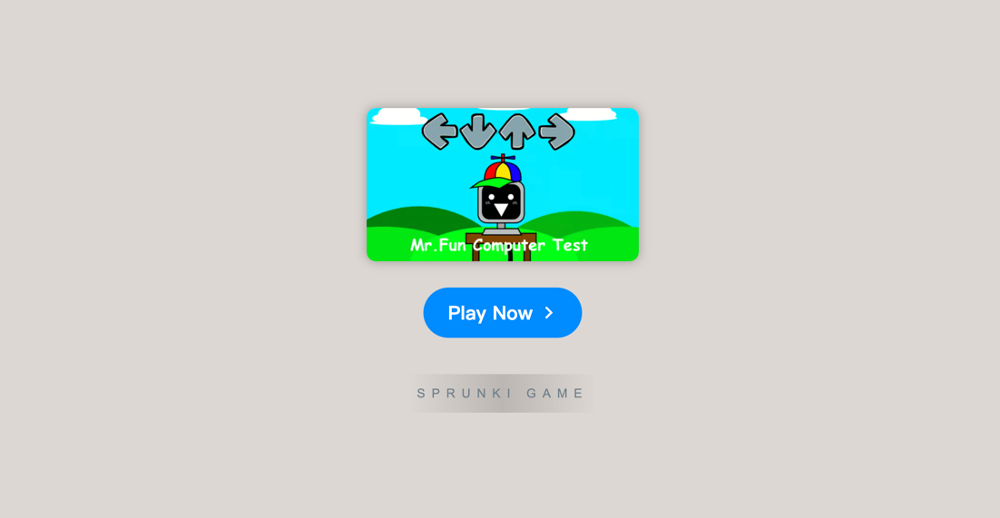

# FNF: Mr. Fun Computer Test

    

Welcome to **[FNF: Mr. Fun Computer Test](https://sprunkionline.com/mr-fun-computer-test)**, a unique addition to the popular Friday Night Funkin' series. This game combines music rhythm gameplay with an intriguing storyline, as you face off against Mr. Fun, a computer-based character with an eerie, yet charming presence. Prepare for a twist on the usual FNF experience, as you navigate through an intense series of tests and challenges.

### Table of Contents
- Overview
- Features
- How to Play
- Game Phases
- Popular Modes
- Tips for Success
- Additional Resources

### Overview

**FNF: Mr. Fun Computer Test** takes the rhythm game format to a whole new level by integrating creepy computer-generated characters with catchy beats. You will play through a series of increasingly difficult challenges as Mr. Fun attempts to test your musical abilities. With original tracks and characters, the game offers a fresh experience for both FNF fans and newcomers.

### Features

| Feature                     | Description                                                                 |
|-----------------------------|-----------------------------------------------------------------------------|
| **Mr. Fun Character**        | A quirky, computer-generated opponent that tests your rhythm skills.        |
| **Unique Tracks**            | Original music that challenges your timing and coordination.                |
| **Multiple Phases**          | A variety of challenging levels with unique beats and rhythms.              |
| **Interactive Gameplay**     | Play with intuitive controls for an engaging rhythm experience.             |
| **Online Play**              | No downloads required—enjoy the game directly in your browser.              |
| **Free Access**              | Play the game without any charges—totally free.                             |
| **Community Interaction**    | Share your scores, experiences, and thoughts with fellow players.           |

### How to Play

To start playing **FNF: Mr. Fun Computer Test**, simply follow these steps:

1. **Choose Your Browser**: Open a modern browser like Chrome, Firefox, or Safari.
2. **Visit the Game Page**: Navigate to [FNF: Mr. Fun Computer Test](https://sprunkionline.com/mr-fun-computer-test).
3. **Start the Game**: Click the "Play" button to begin your musical journey.
4. **Follow the Rhythm**: Hit the corresponding arrow keys in time with the music to win each challenge.
5. **Share Your Experience**: Once you've completed a level, share your score and experience with the community.

### Game Phases

**FNF: Mr. Fun Computer Test** includes several phases, each more challenging than the last:

| Phase               | Description                                                                        |
|---------------------|------------------------------------------------------------------------------------|
| **Phase 1**         | The introductory phase where you learn the basics of rhythm and timing.             |
| **Phase 2**         | A more intense challenge as Mr. Fun introduces faster beats and complex patterns.   |
| **Phase 3**         | The final phase where you face the ultimate rhythm test against Mr. Fun's tricky beats. |
